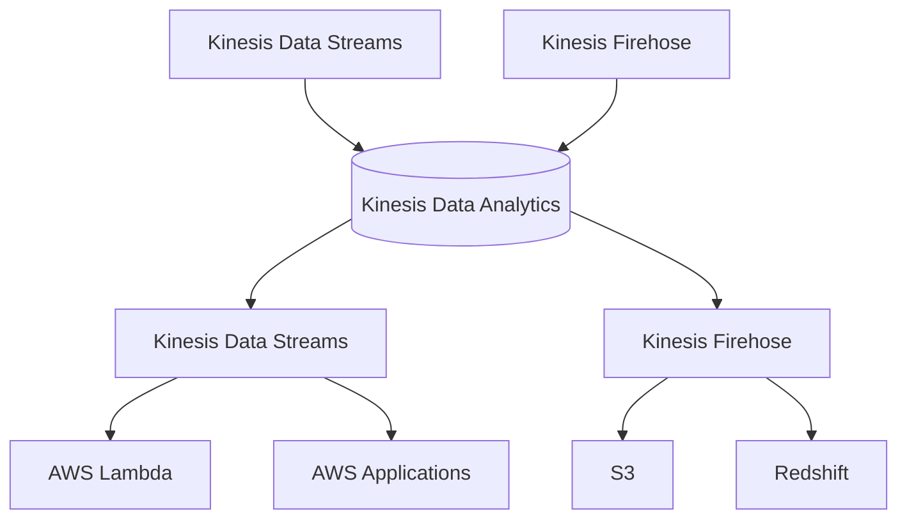

# Amazon Kinesis

## Overview

Amazon Kinesis is a platform on AWS to collect, process, and analyze real-time, streaming data. It enables you to build custom applications that process or analyze streaming data for specialized needs.

## Key Features
- Real-time data ingestion and processing
- Scalable and durable
- Multiple services: Kinesis Data Streams, Kinesis Data Firehose, Kinesis Data Analytics, Kinesis Video Streams
- Integrates with AWS Lambda, S3, Redshift, Elasticsearch, and more
- Secure with encryption and access controls

## Kinesis Services

### Kinesis Data Streams
- Real-time streaming data ingestion
- Custom processing with AWS Lambda or EC2 consumers
- Data is stored in shards (scalable units of throughput)
- Data retention: 24 hours (default), up to 7 days

### Kinesis Data Firehose
- Load streaming data to S3, Redshift, Elasticsearch, or Splunk
- Automatic scaling and data transformation
- Near real-time delivery

### Kinesis Data Analytics
- Real-time analytics on streaming data using SQL
- Integrates with Kinesis Data Streams and Firehose

### Kinesis Video Streams
- Ingest and process video streams in real time
- Supports live and on-demand video analytics

## Security
- Server-side encryption with AWS KMS
- Access control with IAM policies
- VPC endpoints for private connectivity

## Monitoring & Logging
- CloudWatch metrics for stream health and throughput
- CloudTrail for API call auditing

## Best Practices
- Use multiple shards for high-throughput streams
- Monitor stream metrics and set up alerts
- Secure streams with IAM and encryption
- Use enhanced fan-out for high-performance consumers
- Integrate with Lambda for serverless processing

## Kinesis Data Streams

- Retention between 1 day to 365 days
- Ability to reprocess (replay) data
- Once data is inserted in Kinesis, it can’t be deleted (immutability)
- Data that shares the same partition goes to the same shard (ordering)
- Producers: AWS SDK, Kinesis Producer Library (KPL), Kinesis Agent
- Consumers:
	- Write your own: Kinesis Client Library (KCL), AWS SDK
	- Managed: AWS Lambda, Kinesis Data Firehose, Kinesis Data Analytics
- Capacity Modes
	- Provisioned mode:
		- You choose the number of shards provisioned, scale manually or using API
		- Each shard gets 1MB/s in (or 1000 records per second)
		- Each shard gets 2MB/s out (classic or enhanced fan-out consumer)
		- You pay per shard provisioned per hour
	- On-demand mode:
		- No need to provision or manage the capacity
		- Default capacity provisioned (4 MB/s in or 4000 records per second)
		- Scales automatically based on observed throughput peak during the last 30 days
		- Pay per stream per hour & data in/out per GB

## Kinesis Data Analytics

- Real-time analytics on Kinesis Streams using SQL
- Pay for actual consumption, no need to pre-provision anything
- Can create streams from query results

## Kinesis Firehose

- Used for ETL, can load data into Redshift, S3, ElasticSearch etc.
- **Near Real Time**
	- Buffer interval: 0 seconds (no buffering) to 900 seconds
	- Buffer size: minimum 1MB
- Fully managed, automatic scaling
- Low latency (60 seconds)
- Pay for the amount of data which goes through Firehose

## SQS vs SNS vs Kinesis

|   |   |   |
|---|---|---|
|Consumer pulls data|Data is pushed to many subscribers|Consumer pulls data|
|Data is deleted after consumed|Up to 10 million subscribers|Can have as many consumer as we want|
|Can have as many consumer as we want|Data os not persisted|Can replay data|
|No need to provision throughput|Pub/Sub|Used for big data analytics and ETL|
|No ordering (except FIFO)|Up to 100k topics|Data expires after X days|
|Individual message delay capability|No need to provision throughput|Must provision throughput|
||Integrates with SQS for fan-out architecture|Ordering at the shard level|

## Kinesis Operations

- Shard Splitting
	- Used to increase the Stream capacity (1 MB/s data in per shard)
	- Used to divide a “hot shard”
	- The old shard is closed and will be deleted once the data is expired
	- No automatic scaling (manually increase/decrease capacity)
	- Can’t split into more than two shards in a single operation
- Merging Shards
	- Decrease the Stream capacity and save costs
	- Can be used to group two shards with low traffic (cold shards)
	- Old shards are closed and will be deleted once the data is expired
	- Can’t merge more than two shards in a single operation

## Kinesis API

- PutRecord API: requires a partition key which gets hashed.
- Partition key should be highly distributed (otherwise a shard can become overwhelmed)
- PutRecord accepts batches, cost can be reduced
- PutRecord throws ProvisionedThroughputExceeded in case of capacity is exceeded. Solution: exponential back-off, more shards, ensure that partition key is highly distributed

## Kinesis Client Library (KCL)

- It is a Java library that helps read record from a Kinesis Data Stream with distributed applications sharing the read workload
- Each shard should be read by only one KCL instance!
- Progress checkpoint is written to DynamoDB
- Records are read in order at the shard level
- KCL can run on EC2, Elastic Beanstalk, and on-premises

## Shards

- A stream can contain one or more shards
- Write capacity: 1MB/s or 1000 messages per shard
- Read capacity: 2MB/s per shard
- Billing is per shard
- Records are ordered per shard

