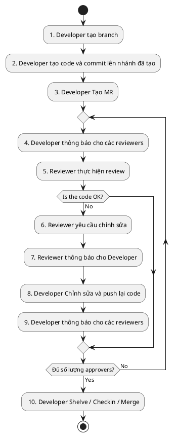

# SECOND-BRAIN gitflow

## 1. Sơ đồ làm việc

## 2. Chú thích

**1. Tạo branch cho từng Task hoặc Bug:**

- Task tạo branch mới theo format: **features/{TaskID}_{Tiêu đề}**
- Bug tạo theo format: **fixes/{TaskID}_{Tiêu đề}**
- Task_ID: bắt buộc nếu có
- Tiêu đề: tiêu đề cần miêu tả ngắn gọn task thực hiện nhiệm vụ gì, dấu cách thay bằng “_”, tuyệt đối không được viết tắt.
- Branch mới phải tạo từ Develop, phần "Create from"
- Trường hợp task phụ thuộc vào task khác (task A có BranchA), thì branch mới phải chọn "Create from" = BranchA

Ví dụ:

- Feature #xxxxxx: tạo TableA và thực hiện insert dữ liệu, tách thành 2 tasks như dưới:

- Task #01: thêm bảng mới TableA vào DB
      + tạo branch **features/01_them_bang_tableA**
- Task #02: insert dữ liệu vào TableA
      + tạo branch **features/02_insert_du_lieu_tableA**

**2. Commit code:**

- Hạn chế nhiều commits trong 1 branch.
- Mỗi commit cần miêu tả rõ ràng phần thay đổi

**3. Merge request (MR):**

- Tên của MR theo format tên của branch (ko cần features hoặc fixes ở tiền tố)
- MR phải chọn target branch mà mình merge vào (thông thường là branch của phần "Create from" ở bước 2).
- Trường hợp target branch là Branch A (ở step 2), thì sau khi BranchA được merged, thì đổi target branch về "Develop"
- Chú ý chọn MR template của dự án SECOND-BRAIN. (template mặc định có tên là Default.md)
- Những tasks liên quan đến thay đổi (ko phải thêm mới) ở phía UI (vd: thay đổi text, screen...) thì cần capture màn hình được update vào comment ở MR để reviewer kiểm tra.
- MR phải được review và approve trước khi merge lên Develop:

> Dev1 tạo MR

> Các reviewers thực hiện **review** => **add comments** => Dev1 **sửa => Dev2 vào review lại và resolved thread nếu đã OK**

- Step1: reviewers thực hiện **review** => **Add comments** nếu có
- Step2: Dev1 kiểm tra comment => reply hoặc update code => đánh dấu task completed => thông báo cho Dev2
- Step3: Dev2 review lại => đánh dấu Thread comment được Resolved

**Chú ý:**

- Chỉ người tạo comment mới có quyền approve comment đó.
- 1 MR yêu cầu ít nhất 4 devs vào review.
