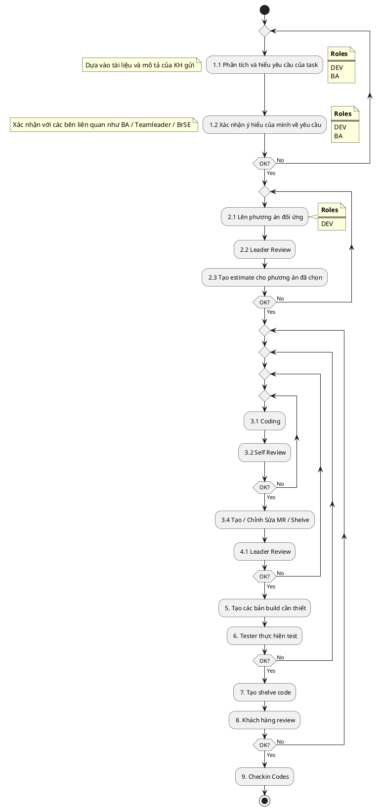

# SECOND-BRAIN Workflow

## 1. Các bước và giải thích

|Step|PIC|Input|Description|Output|Note|
|---|--|---|--|---|---|
|**1.1 Study requirement**|Dev, BA|Các yêu cầu mô tả và tài liệu khách hàng đã gửi|Dev study yêu cầu từ input, có trao đổi với BA/BrSE để làm rõ các thông tin   Note lại Q&A (nếu có) lên redmine|Các tài liệu mô tả cần được lấy về và đính kèm lên redmine từ khi nhận task (nếu tài liệu nhiều cần upload lên Google Drive, tên folder chưa có thể là code/id của task; sau đó phải đính kèm lại link vào redmine)  Các meeting trao đổi cần gọi thêm BA và Tester liên quan vào để cùng nắm thông tin|
|**1.2 Confirm requirement**|Dev|Các yêu cầu mô tả và tài liệu khách hàng đã gửi|Sau khi study xong, cần xác nhận ý hiểu của mình đã đúng chưa với BrSE  Note lại nội dung ý hiểu lên redmine|Các meeting trao đổi cần gọi thêm BA và Tester liên quan vào để cùng nắm thông tin|
|**2.1 Make Solution & Estimation**|Dev|Yêu cầu đã nắm được|Dựa trên yêu cầu, Dev sẽ điều tra sau đó đưa ra solution và estimate thời gian thực hiện.    Chú ý về việc tạo các subtasks và tạo các estimation riêng lẻ đối với từng subtask.|Solution để đối ứng yêu cầu hoặc tối thiểu là có kết quả điều tra rõ ràng đối với những task đánh giá không thể thực hiện  Thời gian cần để thực hiện và mốc deadline|Ở giai đoạn này Dev có thể nhờ các đồng nghiệp, Leader, Senior, ... cùng tư vấn/hỗ trợ nếu cần|
|**2.2 Review Solution**|Leader, Senior, BrSE, Customer|Solution đề xuất  Thời gian cần để thực hiện và mốc deadline|Nhờ những người có kinh nghiệm đánh giá xem solution của Dev có vấn đề gì không, xem có thể đưa vào tiến hành không|Note solution, thời gian cần để thực hiện và mốc deadline đã thống nhất lên redmine|Những yêu cầu phức tạp, ảnh hưởng nhiều có thể nhờ BrSE hỏi ý kiến KH sau khi team đã thống nhất|
|**3.1 Implementation Code**|Dev|Solution đã thống nhất|Dev tiến hành thực hiện code|||
|**3.2 Self Review**|Dev|Code đã thực hiện|Dev tự check lại code theo check-list, coding-convention|File check-list tạo trên folder check-list||
|**3.3 Self Test**|Dev|Code đã thực hiện|Dev tự test lại logic theo yêu cầu|Evidence (photo/video) của việc self-test||
|**3.4 Commit/Shelve & Make Merge Request**|Dev|Code đã thực hiện|Tạo merge-request|Đính kèm lên redmine file check-list và evidence  Sau đó báo cho đồng nghiệp, Leader, Senior, ... cùng review||
|**4.1 Review**|Leader, Senior|Merge Request|Reviewer tiến hành review code theo check-list, kinh nghiệm và coding-convention|Approved/Comment|Cần tối thiểu 3 approved  Nếu chưa đủ cần push các reviewer|
|**5. Build**|Dev|Code đã thực hiện|Tiến hành build code và thông tin cho tester sắp xếp thực hiện verify|||
|**6. Test**|Tester|Bản build|Tester tiến hành verify chức năng, bug, logic,...|Bug log trên redmine (nếu có)  Tài liệu test-case và kết quả test|Nếu có bug cần điền đủ các thông tin Similar/Solution/Cause/Cause Category trên redmine|
|**7. Tạo shelve code**|Dev|Code đã thực hiện||Báo cáo thông tin Shelveset cho BrSE||
|**8. Khách hàng review**|Customer|TFS Shelveset||Kết quả review||
|**9. Checkin Codes**|Dev|Code đã thực hiện||Báo cáo thông tin TFS Changeset cho BrSE||

## 2. Sơ đồ làm việc

